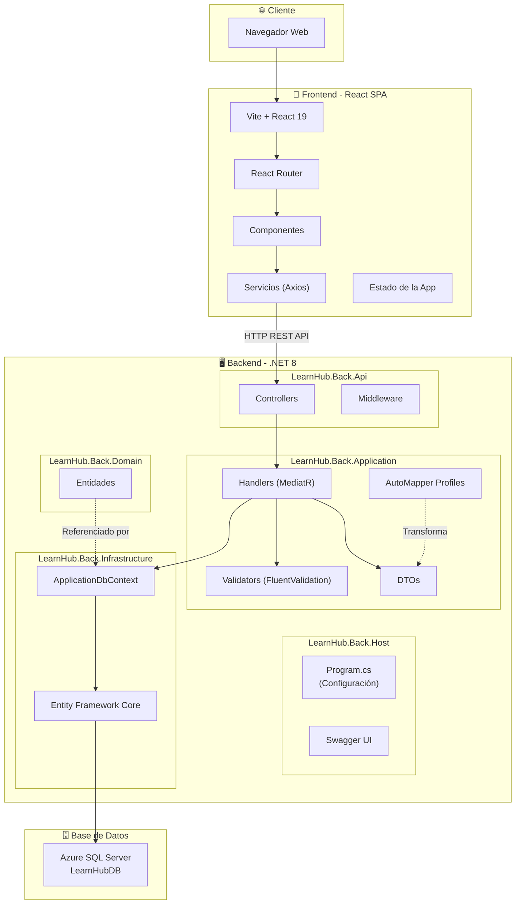
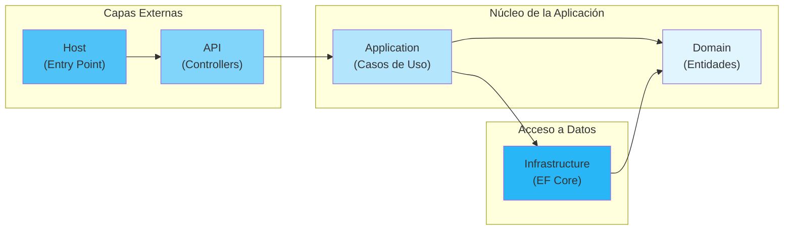
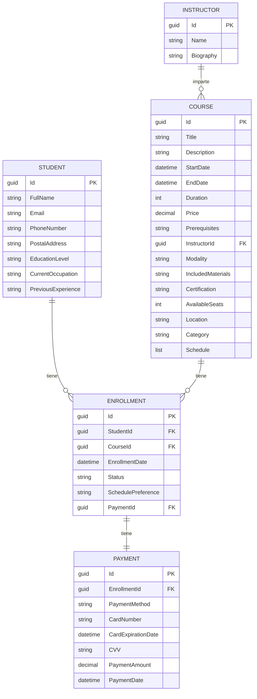
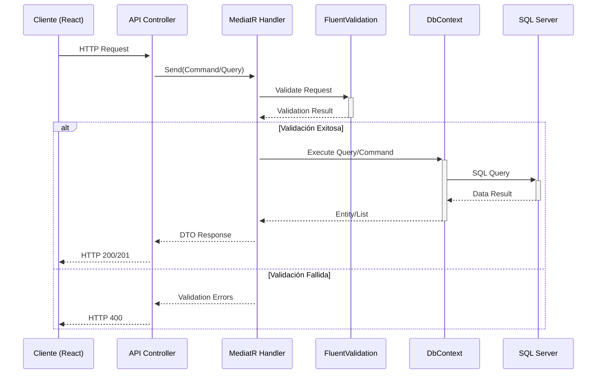

# LearnHub - Documentación de la Solución

## Descripción General

**LearnHub** es una plataforma educativa completa diseñada para la gestión de cursos en línea. La solución se compone de dos aplicaciones principales:

- **Backend**: API RESTful desarrollada en .NET 8 siguiendo una arquitectura Clean Architecture
- **Frontend**: Aplicación web SPA desarrollada en React con TypeScript y Vite

### Tecnologías Principales

| Componente | Tecnología |
|------------|------------|
| Backend Framework | .NET 8 / ASP.NET Core |
| Frontend Framework | React 19 + TypeScript |
| Base de Datos | SQL Server (Azure) |
| ORM | Entity Framework Core 9.0 |
| Bundler | Vite 6.0 |
| Estilos | Tailwind CSS 4.0 |
| Validación | FluentValidation |
| Mediador | MediatR |
| Mapeo | AutoMapper |
| Documentación API | Swagger/OpenAPI |

---

## Arquitectura

### Diagrama de Arquitectura (Mermaid)



### Diagrama de Capas (Clean Architecture)



### Diagrama del Modelo de Datos



### Diagrama de Flujo de la API



---

## Componentes

### Backend (LearnHub.Back)

#### 1. LearnHub.Back.Host
**Tipo**: Proyecto Web ASP.NET Core  
**Función**: Punto de entrada de la aplicación

**Responsabilidades**:
- Configuración de servicios (DI Container)
- Configuración de middleware
- Configuración de Entity Framework Core
- Configuración de Swagger/OpenAPI
- Configuración de CORS
- Configuración de FluentValidation
- Configuración de MediatR

**Dependencias principales**:
- AutoMapper.Extensions.Microsoft.DependencyInjection 12.0.1
- FluentValidation.AspNetCore 11.3.0
- Microsoft.EntityFrameworkCore.Design 9.0.2
- Swashbuckle.AspNetCore 6.5.0

#### 2. LearnHub.Back.Api
**Tipo**: Biblioteca de clases .NET  
**Función**: Capa de presentación (Controllers)

**Controllers disponibles**:
- `CourseController`: Gestión completa de cursos (CRUD)
- `EnrollmentController`: Gestión de inscripciones
- `StudentController`: Gestión de estudiantes

**Endpoints principales**:
| Método | Ruta | Descripción |
|--------|------|-------------|
| GET | /api/course | Obtener todos los cursos |
| GET | /api/course/{id} | Obtener curso por ID |
| POST | /api/course | Crear nuevo curso |
| PUT | /api/course/{id} | Actualizar curso |
| DELETE | /api/course/{id} | Eliminar curso |

#### 3. LearnHub.Back.Application
**Tipo**: Biblioteca de clases .NET  
**Función**: Capa de lógica de aplicación

**Estructura**:
- `Behaviors/`: Comportamientos transversales de MediatR
- `DTOs/`: Objetos de transferencia de datos
- `Handlers/`: Manejadores de comandos y consultas (CQRS)
- `Mappings/`: Perfiles de AutoMapper

**Patrones implementados**:
- CQRS (Command Query Responsibility Segregation)
- Mediator Pattern (MediatR)
- DTO Pattern

#### 4. LearnHub.Back.Domain
**Tipo**: Biblioteca de clases .NET  
**Función**: Capa de dominio (Entidades)

**Entidades**:
- `Student`: Representa a un estudiante
- `Course`: Representa un curso
- `Instructor`: Representa a un instructor
- `Enrollment`: Representa una inscripción
- `Payment`: Representa un pago

#### 5. LearnHub.Back.Infrastructure
**Tipo**: Biblioteca de clases .NET  
**Función**: Capa de infraestructura (Persistencia)

**Componentes**:
- `ApplicationDbContext`: Contexto de Entity Framework Core
- `Migrations/`: Migraciones de base de datos

**Base de datos**: Azure SQL Server (LearnHubDB)

---

### Frontend (LearnHub.Front)

**Tipo**: Aplicación SPA (Single Page Application)  
**Framework**: React 19 con TypeScript

**Estructura del proyecto**:
```
src/
├── components/     # Componentes reutilizables
├── hooks/          # Custom hooks
├── pages/          # Páginas/Vistas
│   ├── course-detail/
│   ├── course-manager/
│   ├── courses/
│   ├── home/
│   ├── profile/
│   └── sign-up/
├── routes/         # Configuración de rutas
├── services/       # Servicios de API
├── store/          # Estado global
├── tests/          # Tests
└── types/          # Definiciones TypeScript
```

**Servicios de API**:
- `courseService.ts`: Operaciones CRUD de cursos
- `student.service.ts`: Operaciones de estudiantes
- `api.ts`: Configuración base de Axios

---

## Características

### Funcionalidades Principales

1. **Gestión de Cursos**
   - Listado de cursos disponibles
   - Detalle de curso con información completa
   - Creación, edición y eliminación de cursos
   - Filtrado por categoría y modalidad

2. **Gestión de Estudiantes**
   - Registro de nuevos estudiantes
   - Perfil de usuario
   - Historial de inscripciones

3. **Sistema de Inscripciones**
   - Inscripción a cursos
   - Estados de inscripción (Aprobada, Rechazada, Pendiente)
   - Preferencias de horario

4. **Sistema de Pagos**
   - Procesamiento de pagos
   - Múltiples métodos de pago
   - Historial de transacciones

---

## Detalles Técnicos

### Versiones de .NET y Paquetes

| Paquete | Versión |
|---------|---------|
| .NET SDK | 8.0 |
| Entity Framework Core | 9.0.2 |
| MediatR | 12.4.1 |
| AutoMapper | 12.0.1 |
| FluentValidation | 11.3.0 |
| Swashbuckle.AspNetCore | 6.5.0 |

### Versiones de Frontend

| Paquete | Versión |
|---------|---------|
| React | 19.0.0 |
| TypeScript | 5.6.2 |
| Vite | 6.0.5 |
| Tailwind CSS | 4.0.3 |
| Axios | 1.7.9 |
| React Router DOM | 7.1.5 |

### Configuración de API

- **Base URL**: `http://localhost:5039/api/`
- **Timeout**: 10000ms
- **Autenticación**: JWT Bearer Token (preparado pero no activo)

### Patrones de Diseño

1. **Clean Architecture**: Separación clara de responsabilidades
2. **CQRS**: Separación de comandos y consultas
3. **Repository Pattern**: A través de EF Core DbContext
4. **Mediator Pattern**: Desacoplamiento con MediatR
5. **DTO Pattern**: Transferencia segura de datos

### Observabilidad

- **Logging**: Configurado con LogLevel en appsettings.json
- **Swagger UI**: Documentación interactiva de API en desarrollo

### Consideraciones de Despliegue

- Backend preparado para Azure App Service
- Base de datos en Azure SQL Server
- Frontend puede desplegarse en cualquier servidor estático (Azure Static Web Apps, Netlify, Vercel)
- Variables de entorno para configuración de conexiones

---

## Diagrama ASCII (Referencia Alternativa)

```
┌─────────────────────────────────────────────────────────────────────────┐
│                           LearnHub Platform                              │
├─────────────────────────────────────────────────────────────────────────┤
│                                                                          │
│  ┌──────────────────────┐           ┌──────────────────────────────┐    │
│  │    React Frontend    │           │      .NET 8 Backend          │    │
│  │    (Vite + TS)       │           │      (ASP.NET Core)          │    │
│  └──────────┬───────────┘           └──────────────┬───────────────┘    │
│             │                                      │                     │
│             │ HTTP/REST                            │                     │
│             └──────────────────┬───────────────────┘                     │
│                                │                                         │
│                                ▼                                         │
│                    ┌───────────────────────┐                            │
│                    │   Azure SQL Server    │                            │
│                    │      LearnHubDB       │                            │
│                    └───────────────────────┘                            │
│                                                                          │
├─────────────────────────────────────────────────────────────────────────┤
│                    Backend Architecture (Clean Architecture)             │
├─────────────────────────────────────────────────────────────────────────┤
│                                                                          │
│  ┌─────────────┐  ┌─────────────┐  ┌─────────────┐  ┌─────────────┐    │
│  │    Host     │──│    API      │──│ Application │──│   Domain    │    │
│  │  (Entry)    │  │ (Controllers│  │  (Handlers) │  │ (Entities)  │    │
│  └─────────────┘  └─────────────┘  └─────────────┘  └─────────────┘    │
│         │                                                   ▲            │
│         │                                                   │            │
│         │              ┌─────────────────┐                  │            │
│         └──────────────│ Infrastructure  │──────────────────┘            │
│                        │  (EF Core)      │                               │
│                        └─────────────────┘                               │
│                                                                          │
└─────────────────────────────────────────────────────────────────────────┘

Entidades del Dominio:

    ┌────────────┐       ┌────────────┐       ┌────────────┐
    │  Student   │◄──────│ Enrollment │──────►│   Course   │
    └────────────┘       └─────┬──────┘       └──────┬─────┘
                               │                     │
                               ▼                     ▼
                        ┌────────────┐       ┌────────────┐
                        │  Payment   │       │ Instructor │
                        └────────────┘       └────────────┘
```

---

## Archivo Generado

- **Fecha de generación**: 2 de Diciembre de 2025
- **Hora**: 15:19:07 UTC
- **Formato de diagrama**: Mermaid + ASCII

---

*Documentación generada automáticamente para el proyecto LearnHub.*
